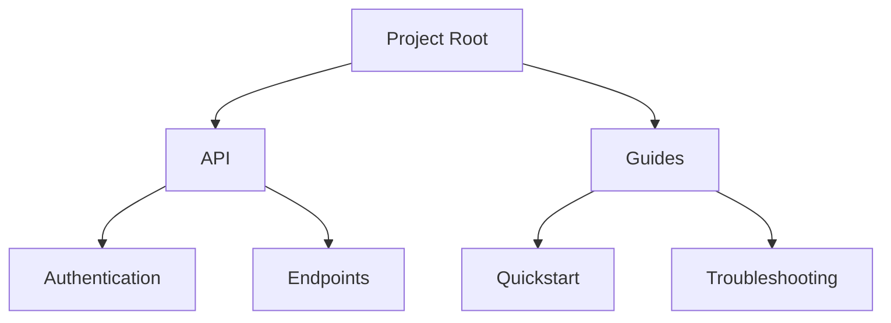

## Overview

Pakusaru provides powerful tools to streamline your documentation workflow. You create, organize, collaborate, and track changes effortlessly. Use these core features to build a centralized knowledge base for your projects.

<Columns cols={2}>
  <Card title="Document Creation & Editing" icon="edit-3" href="#document-creation">
    Craft rich Markdown documents with real-time previews.
  </Card>
  <Card title="Folder & Page Organization" icon="folder" href="#organization">
    Structure your docs hierarchically for easy navigation.
  </Card>
  <Card title="Collaboration & Sharing" icon="users" href="#collaboration">
    Invite teams and share securely with granular permissions.
  </Card>
  <Card title="Search & Version History" icon="search" href="#search-history">
    Find content instantly and revert changes as needed.
  </Card>
</Columns>

## Document Creation and Editing

Start building your docs immediately. Pakusaru supports full MDX editing with live previews, syntax highlighting, and version control integration.

<Steps>
  <Step title="Create New Document" icon="plus">
    Navigate to your project dashboard and select `New Document`. Choose from templates like API reference or guide.
  </Step>
  <Step title="Edit with MDX" icon="edit">
    Write in Markdown with embedded components. Preview changes side-by-side.
  </Step>
  <Step title="Publish" icon="upload">
    Save and publish. Your doc appears in the navigation instantly.
  </Step>
</Steps>

<CodeGroup tabs="MDX,API">
  ```mdx
  ## Welcome

  Use <Callout kind="info">components</Callout> for rich content.

  ```javascript
  console.log('Pakusaru docs');
  ```
  ```
  ```javascript
  const response = await fetch('https://api.example.com/docs', {
    method: 'POST',
    headers: { 'Authorization': 'Bearer YOUR_API_KEY' },
    body: JSON.stringify({ title: 'New Doc', content: '# Hello' })
  });
  ```
</CodeGroup>

<Callout kind="tip">
  Enable auto-save to prevent data loss during long editing sessions.
</Callout>

## Folder and Page Organization

Organize large documentation sets with nested folders and pages. Drag and drop to reorder, and use slugs for clean URLs.



Customize navigation with frontmatter in your MDX files:

```
---
title: Authentication
sidebar_position: 1
---
```

## Collaboration and Sharing Options

Invite team members and control access precisely.

<Tabs>
  <Tab title="Team Invite" icon="users">
    Share project links with edit or view permissions. Use role-based access like Admin, Editor, Viewer.
  </Tab>
  <Tab title="Public Sharing" icon="globe">
    Generate public read-only links. Embed docs in your site with iframes.
  </Tab>
  <Tab title="Export" icon="download">
    Export to PDF or Markdown ZIP for offline use.
  </Tab>
</Tabs>

## Search and Version History

Pakusaru's full-text search indexes all content. Type keywords to find docs across folders.

<ExpandableGroup>
  <Expandable title="Access Version History" default-open="true">
    Click the history icon on any page. View diffs, restore previous versions, or compare changes.
  </Expandable>
  <Expandable title="Advanced Search Filters">
    Filter by folder, author, or date. Use operators like `from:user api` for precise results.
  </Expandable>
</ExpandableGroup>

<Callout kind="success">
  All changes are tracked automatically—no manual commits required.
</Callout>

These features make Pakusaru your go-to for scalable documentation. Start with a new project today to experience the workflow.