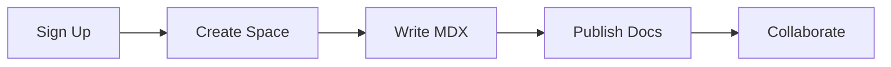

## Overview

Pakusaru provides a centralized space to organize, manage, and collaborate on your project documentation. You create custom spaces for teams, projects, or products, using familiar Markdown and MDX syntax enhanced with powerful components. Build interactive guides, API references, and changelogs that scale with your needs.

## Key Features

Pakusaru stands out with intuitive tools that streamline documentation workflows.

<Columns cols={3}>
  <Card title="MDX Components" icon="code" href="#mdx-components">
    Embed interactive elements like tabs, steps, and code groups directly in your docs.
  </Card>
  <Card title="Version Control" icon="git-branch" href="#version-control">
    Track changes, preview updates, and roll back with integrated Git support.
  </Card>
  <Card title="Collaboration" icon="users" href="#collaboration">
    Invite team members, assign reviewers, and discuss edits in real-time.
  </Card>
</Columns>

<Callout kind="info">
  All features integrate seamlessly, so you focus on content, not configuration.
</Callout>

## Quick Start

Get your first documentation space running in minutes.

<Steps>
  <Step title="Create Account" icon="user-plus">
    Sign up at `https://pakusaru.com` with your email. Verify and log in to access the dashboard.
  </Step>
  <Step title="Set Up Space" icon="folder-plus">
    Click **New Space**, name it (e.g., "My Project Docs"), and select your brand color `#3B82F6`.
  </Step>
  <Step title="Add First Doc" icon="file-plus">
    Create `introduction.mdx` and start writing. Use the live preview to see components render instantly.
  </Step>
</Steps>

Here's a simple MDX example you can copy into your first file:

<CodeGroup tabs="MDX,Bash">
  ```mdx
---
title: My First Doc
description: Hello world example.
---

## Hello Pakusaru

Welcome to your docs!
  ```
  ```bash
npm install -g @pakusaru/cli
pakusaru init my-docs
cd my-docs
pakusaru dev
  ```
</CodeGroup>

## Quick Navigation

Jump to essential sections to build your documentation faster.

<Columns cols={2}>
  <Card title="Quickstart" icon="zap" href="/quickstart">
    Complete setup guide with code examples.
  </Card>
  <Card title="Authentication" icon="shield" href="/authentication">
    Secure your spaces with API keys and tokens.
  </Card>
  <Card title="Guides" icon="book-open" href="/guides">
    Advanced topics and best practices.
  </Card>
  <Card title="Changelog" icon="git-commit" href="/changelog">
    Latest updates and improvements.
  </Card>
</Columns>

## Why Choose Pakusaru

Pakusaru excels for teams needing flexible, powerful documentation without complexity.

<Expandable title="Compare with Alternatives" default-open="false">
  | Feature | Pakusaru | Static Sites | Wiki Tools |
  |---------|----------|--------------|------------|
  | MDX Support | Full | Limited | None |
  | Custom Components | Yes | Plugins needed | Basic |
  | Real-time Collab | Built-in | No | Limited |
  | Version History | Git-powered | Manual | Basic |
</Expandable>

<Callout kind="tip">
  Start with the <Card title="Quickstart" icon="zap" href="/quickstart" horizontal cta="Get Started"/> link above. Customize your space using `{brandColor: '#3B82F6'}` in config for a branded look.
</Callout>

